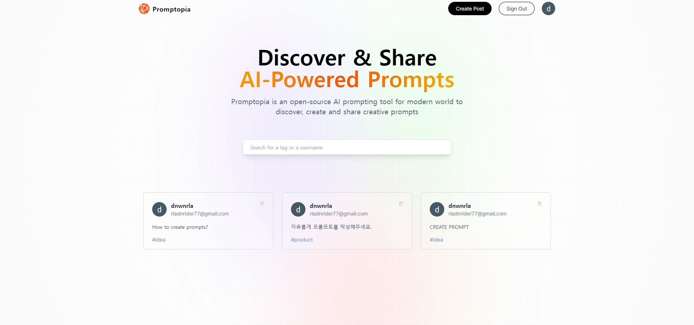

# 🧐Next.js로 AI-prompt 사이트 만들기
유튜브 강의를 통해서 Next.js를 사용해 AI-Prompt 사이트를 만들었습니다.   
[참조영상](https://www.youtube.com/watch?v=wm5gMKuwSYk)   
<br/>



## 초기세팅
`npx create-next-app@latest .`   
`npm i bcrypt mongoose mongodb next-auth`   

## 🧾개념 정리
- Next.js   
React 기반의 JavaScript 프레임워크로, 웹 애플리케이션을 빠르고 효율적으로 개발할 수 있도록 도와주는 도구와 구조를 제공합니다. Next.js는 React 애플리케이션을 서버 사이드 렌더링 (SSR) 및 정적 사이트 생성 (Static Site Generation, SSG)과 같은 기술을 사용하여 최적화하며, 빌드 및 배포를 간편하게 만들어줍니다.   

- Bcrypt   
해시 함수를 사용하여 비밀번호와 같은 민감한 정보를 안전하게 저장하기 위한 라이브러리입니다. 주로 사용자 인증 시스템에서 비밀번호를 안전하게 저장하는 데에 활용됩니다. bcrypt는 단방향 해시 함수로서, 해시된 결과를 다시 원본 데이터로 되돌리기 어렵게 만들어져 있습니다.   

- mongoDB   
NoSQL 데이터베이스로서, 문서 기반의 데이터베이스 시스템입니다. MongoDB는 데이터를 BSON(Binary JSON) 형식의 문서로 저장하며, 이러한 문서들은 컬렉션(Collection) 안에서 관리됩니다. MongoDB는 JSON과 비슷한 BSON 형식을 사용하며, 유연한 스키마를 허용하여 데이터 모델링을 간편하게 할 수 있습니다.   

- mongoose   
MongoDB와 함께 사용되는 Node.js 기반의 ODM(Object Data Modeling) 라이브러리입니다. ODM은 MongoDB의 문서 데이터베이스와 Node.js 애플리케이션 간의 상호 작용을 단순화하고 개발자가 데이터 모델을 정의하고 조작하는 데 도움을 줍니다.   

- next-auth   
Next.js 애플리케이션에서 손쉽게 인증 및 인가를 구현하기 위한 라이브러리입니다. 이 라이브러리는 다양한 인증 제공자(구글, 페이스북, 트위터 등)와 함께 작동하며, 세션 관리와 다양한 기능들을 제공하여 개발자가 복잡한 인증 로직을 구현하지 않고도 빠르게 설정할 수 있도록 도와줍니다.   

- TailwindCSS   
CSS 프레임워크로, HTML 마크업에 직접 클래스를 적용하여 스타일을 적용하는 방식을 채택합니다. Tailwind는 많은 사전 정의된 유틸리티 클래스를 제공하여 빠르고 효과적으로 스타일을 적용할 수 있도록 도와줍니다.   

- CSR   
CSR이란 페이지를 클라이언트 측에서 처리하는 접근 방식입니다. CSR은 최초에 페이지를 로딩할 때 필요한 정적 자원만 전송되고, 동적 데이터는 사용자의 브라우저에서 JavaScript를 사용하여 비동기적으로 로드됩니다. 이로 인해 초기 로딩 속도가 향상되며, 사용자의 경혐을 향상할 수 있습니다. 그러나 검색 엔진 최적화(SEO)가 어렵다는 단점이 존재합니다. 이를 극복하기 위해 사전 렌더링을 통한 SEO 최적화 기술이 사용되기도 합니다.   

- SSR   
SSR이란 페이지를 서버에서 렌더링하여 초기 로딩 성능을 향상시킵니다. 이는 검색 엔진 최적화(SEO)에 유리하고, 초기 페이지 로딩 속도를 높여 사용자 경험을 향상시킵니다.


## 🔍주요 기능   
[회원가입 & 로그인]   

회원가입과 로그인 기능은 [GoogleCloud](https://cloud.google.com)를 이용해 작업했습니다.   

```js
 providers: [
        GoggleProvider({
            clientId: process.env.GOOGLE_ID,
            clientSecret: process.env.GOOGLE_CLIENT_SECRET,
        })
    ],
```

환경변수에 구글 클라우드 아이디와 시크릿 번호를 작성한 뒤, next-auth가 제공하는 GoogleProvider을 이용하면 손쉽게 구글 로그인을 할 수 있습니다.   
<br/>
<br/>
[프롬프트 작성]   

로그인을 하면 프롬프트를 작성해 다른 사람들과 공유할 수 있습니다.   

```js
    const createPrompt = async (e) => {
        e.preventDefault();
        setSubmitting(true);

        try {
            ...데이터 받아오기
        } catch (error) {
            console.log(error);
        } finally {
            setSubmitting(false);
        }
    }

    return (
        <Form
            type='Create'
            post={post}
            setPost={setPost}
            submitting={submitting}
            handleSubmit={createPrompt}
        />
    )
```

작성 버튼을 누르면 `createPrompt`함수가 실행되면서 데이터를 받아오고, 데이터베이스에 저장합니다.   
<br/>
<br/>
[프롬프트 수정&삭제]   
수정과 삭제는 ID값을 주소로 보내서 그 값을 대조해서 사용자가 맞는지 확인하고, 실행합니다.   

```js
const handleProfileClick = () => {
    console.log(post);

    if (post.creator._id === session?.user.id) return router.push("/profile");

    router.push(`/profile/${post.creator._id}?name=${post.creator.username}`);
}
```
프로필 페이지에서 프롬프트를 수정하거나 삭제할때, 유저의 ID값을 같이 보냅니다.

<br/>
<br/>
[검색 기능]   

검색 기능은 간단한 함수를 통해 만들었습니다.   

```js
const [searchText, setSearchText] = useState('');
const [searchTimeout, setSearchTimeout] = useState(null);
const [searchResults, setSearchResults] = useState([]);

const handleSearchChange = (e) => {
    clearTimeout(searchTimeout);
    setSearchText(e.target.value);

    setSearchTimeout(
        setTimeout(() => {
            const searchResult = filterPrompts(e.target.value)
            setSearchResults(searchResult);
        }, 500)
    );
};
```

<br/>
<br/>

## 😱트러블슈팅   
<details>
    <summary>
    MongoDB오류
    </summary>

    - 문제 원인   
    
    "dependencies": {
    "bcrypt": "^5.1.1",
    "mongodb": "^6.3.0",
    "mongoose": "^8.1.0",
    "next": "14.0.4",
    "next-auth": "^4.24.5",
    "react": "^18",
    "react-dom": "^18"
    },   

    버전이 높아서 문법오류
    
    - 문제 해결

    "dependencies": {
    "bcrypt": "^5.1.1",
    "mongodb": "^6.3.0",
    "mongoose": "^7.1.0",
    "next": "14.0.4",
    "next-auth": "^4.24.5",
    "react": "^18",
    "react-dom": "^18"
    },   

    버전을 낮춰 다시 설치하면 해결
</details>

## 📎사이트
회원가입&로그인 - [Google Cloud](https://cloud.google.com)   
데이터베이스 - [mongoDB](https://www.mongodb.com)   
배포 - [vercel](https://vercel.com)   

## 📕스택
<div>
  <a href="#"></a>
  <a href="#"></a>
  <a href="#"></a>
  <a href="#"></a>
  <a href="#"></a>
</div>


